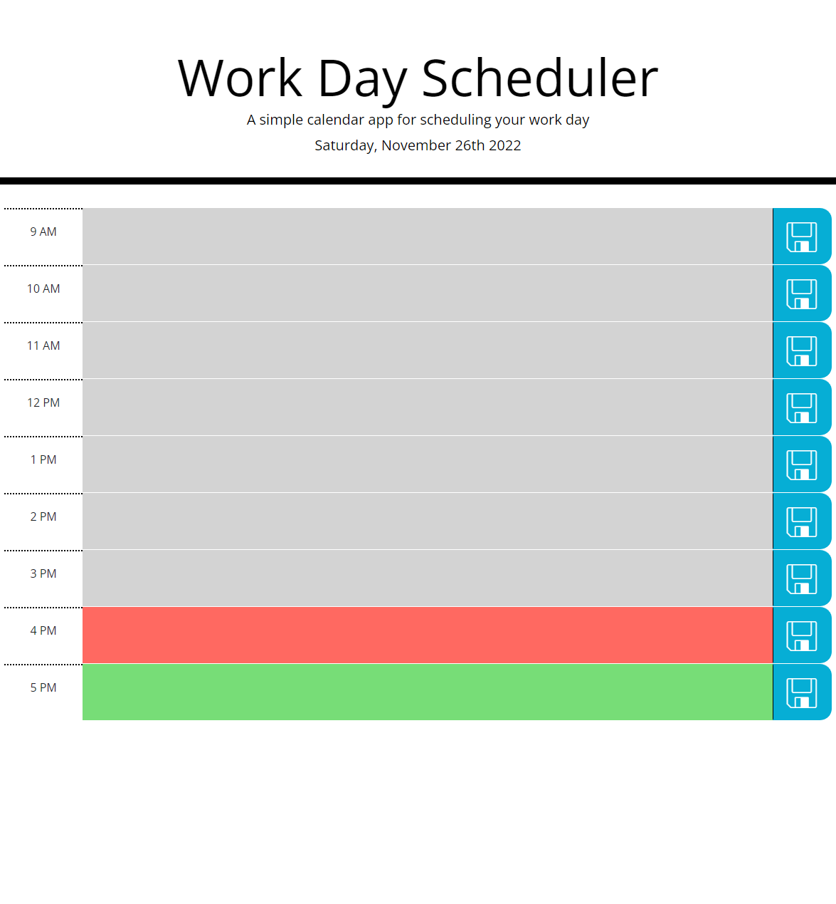

# Work-Day-Planner-Refactor

## Description

Provide a short description explaining the what, why, and how of your project. Use the following questions as a guide:

- What was your motivation?
    - To refactor a webpage that allows a user to plan their 9 to 5 workday while being able to save any entry notes to their local device using primarily JavaScript.
- Why did you build this project?
    - To showcase my expanding knowledge and JavaScript, HTML and CSS.
- What did you learn?
    - How to create elements using JavaScript
    - How to add/ and append ids and classes to elements using JavaScript
    - How to store and retrieve data from a larger array storage.
    - How to use dayJS on a small scale.

## Table of Contents 

- [Usage](#usage)
- [Credits](#credits)
- [License](#license)
- [Features](#features)

## Usage
  

    - This webpage can be viewed by following the below link:
        - https://garrettwinter.github.io/work-day-planner-refactor/
        
    - Below a screenshot of the webpage:

## Credits

While working on this project I had collaborated in real-time with:
  - Garrett Winter (https://github.com/garrettWinter)
  - Salahuddin Imdad (https://github.com/Sal8298)

## License

MIT License

Copyright (c) 2022 Garrett Winter

Permission is hereby granted, free of charge, to any person obtaining a copy
of this software and associated documentation files (the "Software"), to deal
in the Software without restriction, including without limitation the rights
to use, copy, modify, merge, publish, distribute, sublicense, and/or sell
copies of the Software, and to permit persons to whom the Software is
furnished to do so, subject to the following conditions:

The above copyright notice and this permission notice shall be included in all
copies or substantial portions of the Software.

THE SOFTWARE IS PROVIDED "AS IS", WITHOUT WARRANTY OF ANY KIND, EXPRESS OR
IMPLIED, INCLUDING BUT NOT LIMITED TO THE WARRANTIES OF MERCHANTABILITY,
FITNESS FOR A PARTICULAR PURPOSE AND NONINFRINGEMENT. IN NO EVENT SHALL THE
AUTHORS OR COPYRIGHT HOLDERS BE LIABLE FOR ANY CLAIM, DAMAGES OR OTHER
LIABILITY, WHETHER IN AN ACTION OF CONTRACT, TORT OR OTHERWISE, ARISING FROM,
OUT OF OR IN CONNECTION WITH THE SOFTWARE OR THE USE OR OTHER DEALINGS IN THE
SOFTWARE.

## Features

Some notable items for this project are:
    - Dynamically shows the day of the week and the date upon load of the page.
    - Dynamic changes the background of the hour block based on what time it is of the day.
        Grey - In the past
        Red - Currently that hour
        Green - In the future.
    - User is able to place comments in an hour block and click the save button.
    - Users is let known the comments are saved via a message that is added to the page.
    - Data is stored on the users local machine and if present on page load will be displayed to the user.
